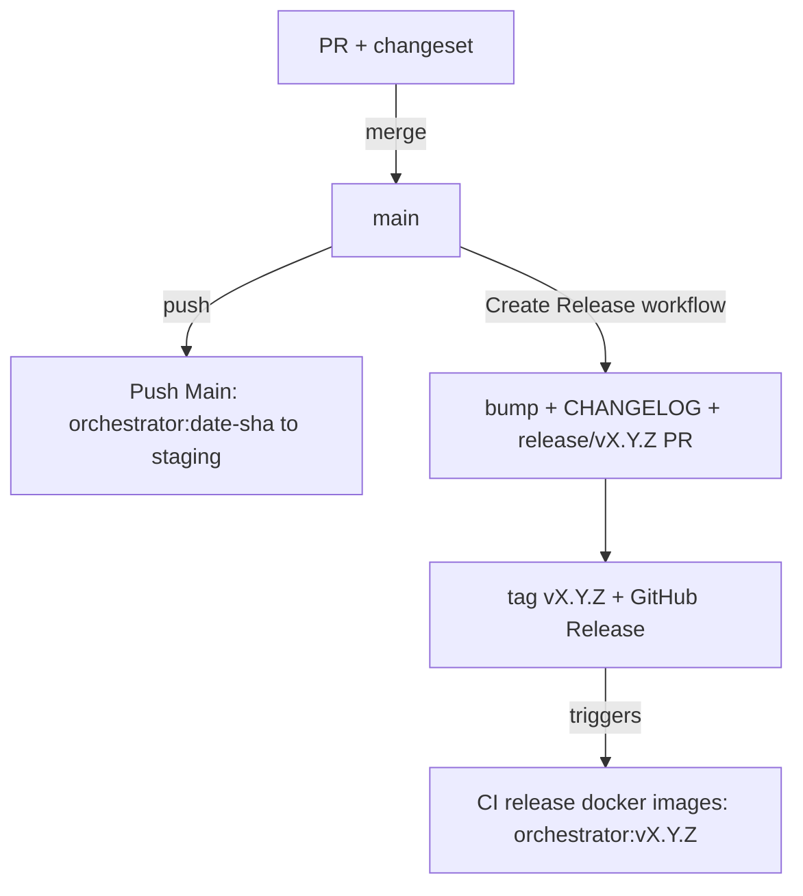

# Jardinero Release Process

How we version Jardinero and ship a release. The flow is built on [changesets](https://github.com/changesets/changesets).

## Overview

Two things that are easy to conflate:

**Release** produces a versioned, immutable artifact: a git tag `vX.Y.Z`, a GitHub Release with notes, and a Docker image `orchestrator:vX.Y.Z` in GCR. It does not deploy anything.

**Staging deploy** is separate and continuous: every push to `main` builds an `orchestrator:<date>-<sha>` image for the deploy. That keeps happening regardless of releases, so staging is never blocked on cutting a version.

A release is the artifact you pin in production and roll back to. Wiring a production target to a released tag is out of scope here (staging stays on the continuous image).

## How a version number is chosen

You never type a version number. Each PR ships a **changeset**: a small file that says whether the change is a `patch`, `minor`, or `major`, plus a one-line summary. When a release is cut, changesets adds up the pending changesets and bumps to the highest level among them. The changeset is the single source of truth for both the number and the changelog entry.

## How to author a change (every PR)

Run this in your branch and answer the two prompts (bump level, summary):

```bash
make changeset
```

It writes a `.changeset/<name>.md` file. Commit it alongside your code. A PR that touches source without a changeset fails the **Check changeset** job. If the change genuinely needs no release (docs, CI tweaks), record an empty one:

```bash
pnpm exec changeset add --empty
```

## How to cut a release

1. Run the **Create Release** workflow from the Actions tab (no inputs).
2. It bumps the version, rewrites `CHANGELOG.md` from the pending changesets, and opens a `release/vX.Y.Z` PR that auto-merges once checks pass.
3. On the same run it tags `vX.Y.Z` and publishes the GitHub Release.
4. The tag triggers the image build. When it finishes, `orchestrator:vX.Y.Z` is in GCR.

That is the whole job: one click, then merge the PR it opens.

## The flow end to end



## The workflows

| Workflow | File | Trigger | What it does |
|----------|------|---------|--------------|
| Pull Request | `pull-request.yml` | every PR | runs `make check`, verifies a changeset is present |
| Push Main | `push-main.yml` | push to `main` | runs `make check`, builds the `<date>-<sha>` staging image |
| Create Release | `create-release.yml` | manual | bumps version, opens the release PR, cuts the tag + GitHub Release |
| CI release docker images | `release-docker.yml` | tag `v*` | runs `make check`, builds `orchestrator:vX.Y.Z` |

## The changelog

`CHANGELOG.md` is owned by changesets from `0.2.0` on; do not hand-edit it. Entries link back to their PR, commit, and author. Each version header is date-stamped to `## [X.Y.Z] - YYYY-MM-DD`. The header prose other repos carry is intentionally absent: the changesets CLI inserts each new version right under the title, so anything between the title and the first version heading would be pushed down into the release and leak into its notes.

## One-time setup

Releases authenticate as the **CHANGESET_BOT** GitHub App, via `actions/create-github-app-token`. This is what attributes the release PR and tag to a bot instead of a person, and what lets the tag trigger the downstream image build (the default `GITHUB_TOKEN` cannot). Before the first release:

- Install the **CHANGESET_BOT** app on this repository with `contents` and `pull-requests` write.
- Make sure the org secrets `CHANGESET_BOT_APP_ID` and `CHANGESET_BOT_PRIVATE_KEY` are visible to this repo (org-level, the way the `CI_GCP_*` secrets already are).
