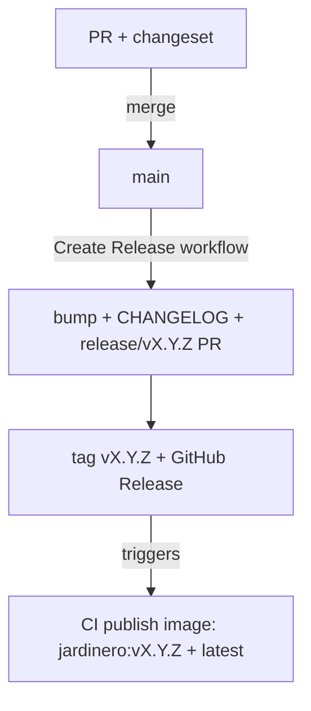

# Jardinero Release Process

How we version Jardinero and ship a release. The flow is built on [changesets](https://github.com/changesets/changesets).

## Overview

A release produces a versioned, immutable artifact: a git tag `vX.Y.Z`, a GitHub Release with notes, and the image `ghcr.io/luxorlabs/jardinero:vX.Y.Z`, also published as `latest`. It deploys nothing: a release is the artifact a deployment pins to and rolls back to.

## How a version number is chosen

You never type a version number. Each PR ships a **changeset**: a small file that says whether the change is a `patch`, `minor`, or `major`, plus a one-line summary. When a release is cut, changesets adds up the pending changesets and bumps to the highest level among them. The changeset is the single source of truth for both the number and the changelog entry.

## How to author a change (every PR)

Run this in your branch and answer the two prompts (bump level, summary):

```bash
make changeset
```

It writes a `.changeset/<name>.md` file. Commit it alongside your code. A PR that touches source without a changeset fails the **Check changeset** job. If the change genuinely needs no release (docs, CI tweaks), record an empty one:

```bash
pnpm exec changeset add --empty
```

## How to cut a release

1. Run the **Create Release** workflow from the Actions tab (no inputs).
2. It bumps the version, rewrites `CHANGELOG.md` from the pending changesets, and opens a `release/vX.Y.Z` PR that auto-merges once checks pass.
3. On the same run it tags `vX.Y.Z` and publishes the GitHub Release.
4. The tag triggers the image build. When it finishes, `ghcr.io/luxorlabs/jardinero:vX.Y.Z` and `:latest` are published.

That is the whole job: one click, then merge the PR it opens.

## The flow end to end



## The workflows

| Workflow | File | Trigger | What it does |
|----------|------|---------|--------------|
| Pull Request | `pull-request.yml` | every PR | runs `make check`, verifies a changeset is present |
| Push Main | `push-main.yml` | push to `main` | runs `make check` |
| Create Release | `create-release.yml` | manual | bumps version, opens the release PR, cuts the tag + GitHub Release |
| CI publish image | `publish-image.yml` | tag `v*` | runs `make check`, publishes `jardinero:vX.Y.Z` and `:latest` |

## What a published image carries

Every image the publish workflow pushes is signed and described, so a consumer can establish where it came from without trusting the registry:

- **A cosign signature.** Keyless, over the image digest. The certificate is issued to the workflow's OIDC identity, so verification can require a specific repository, workflow file and ref rather than merely the org. There is no signing key to hold or rotate.
- **A SLSA provenance attestation**, verifiable with `gh attestation verify`. It states the same origin claim through an independent path, for consumers who have the `gh` CLI but not cosign.
- **An SBOM**, generated by BuildKit at build time.
- **OCI labels**, including `org.opencontainers.image.source`, which links the package back to this repository and is what makes the package page show this README.

Verification is documented for consumers in [`../examples/deploy/README.md`](../examples/deploy/README.md).

## The changelog

`CHANGELOG.md` is owned by changesets; do not hand-edit it. Entries link back to their PR, commit, and author. Each version header is date-stamped to `## [X.Y.Z] - YYYY-MM-DD`. The header prose other repos carry is intentionally absent: the changesets CLI inserts each new version right under the title, so anything between the title and the first version heading would be pushed down into the release and leak into its notes.
