# Workflow engine

Every piece of work Jardinero does is an instance of one of five **workflows**, each implemented as a state machine. That machine is the only place that decides what happens next: adapters translate and report, the sandbox pool executes and rations, and neither of them chooses the next step.

Two words that are not the same thing: a **workflow** is the machine and the instance it advances; an **agent** is a seat that runs inside a sandbox, and one workflow can dispatch more than one. LinearImplementer the workflow dispatches the LinearImplementer agent and then the LinearVerifier agent, both against the same instance.

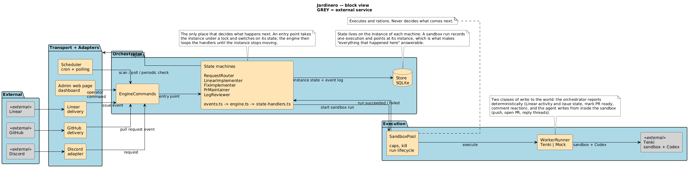

## How a workflow is built

Four files under `src/orchestrator/state-machines/<workflow>/`, always the same shape:

- **`events.ts`** — one exported function per entry point (`onPrComment`, `onSandboxRunSucceeded`, …). It takes the instance under a lock, switches on the state it is in, and refuses a state it does not know about instead of guessing.
- **`engine.ts`** — the loop. It calls the handler for the current state, writes the state it returns, and keeps going until the instance stops moving.
- **`state-handlers.ts`** — one `handleState<X>` per state, returning the next state. This is where a sandbox run is started.
- **`service.ts`** — the engine class, its config, and the ports it needs of the outside world, each declared by the machine that needs it.

What the code inside those four has to look like is [the shape of a state machine](../../AGENTS.md#the-shape-of-a-state-machine): the return type every entry point answers with, and the four shapes a `case` may take.

Two entry points exist on all five: `onPeriodicCheck`, which is how an instance whose run died gets picked up again, and `onSystemRecovery`, which runs at boot for the same reason after a restart.

Every workflow has a `*_pending` state meaning "the instance exists and no run was dispatched", which is what makes recovery checkable. The three that can get stuck have a state that waits for a person, and from the dashboard that person has two answers: retry it, or dismiss it into a `*_dismissed` ending.

## The five workflows

| Workflow | Owns | Starts from |
|---------|------|-------------|
| RequestRouter | one inbound request, from any source | Discord, GitHub, Linear, cron or the operator |
| LinearImplementer | one Linear ticket delegated to us | the ticket is assigned to Jardinero |
| FixImplementer | one log finding, keyed by its fingerprint | a scan reported the finding |
| PrMaintainer | one pull request | we opened it, or someone tagged us on it |
| LogReviewer | one scan of one service | the cron, a successful deploy, or an admin trigger |

Each diagram below is the list of that machine's states and of every event that moves it. Yellow is a state that waits, red is a state that waits for a person, green is an ending.

### RequestRouter

The door, not the work: it resolves a request into a subject and hands it over. A request that already names its subject never costs an agent run; only free text dispatches one.

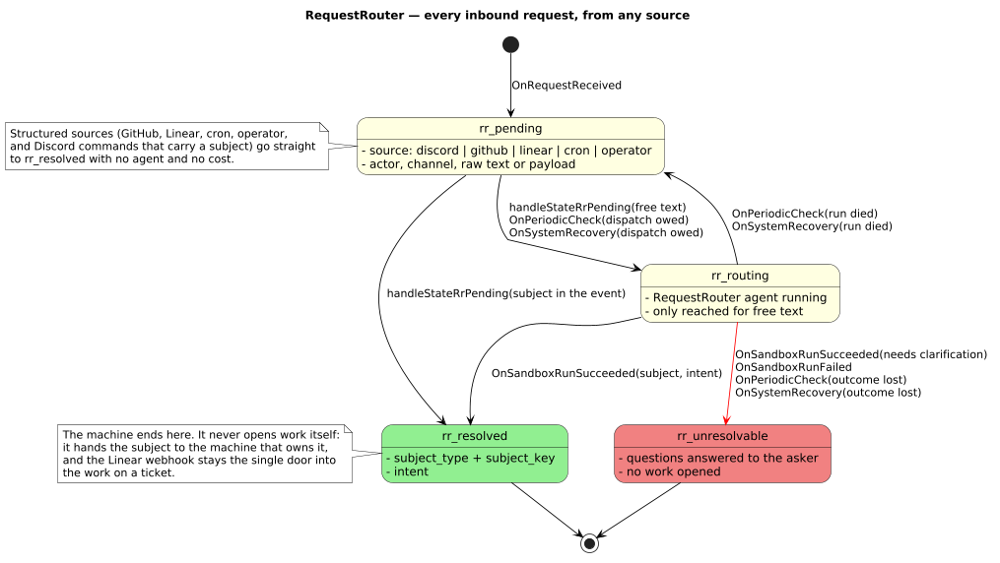

### LinearImplementer

Implements the ticket and then verifies its own work against the ticket's criteria, iterating while the verifier rejects and the budget lasts.

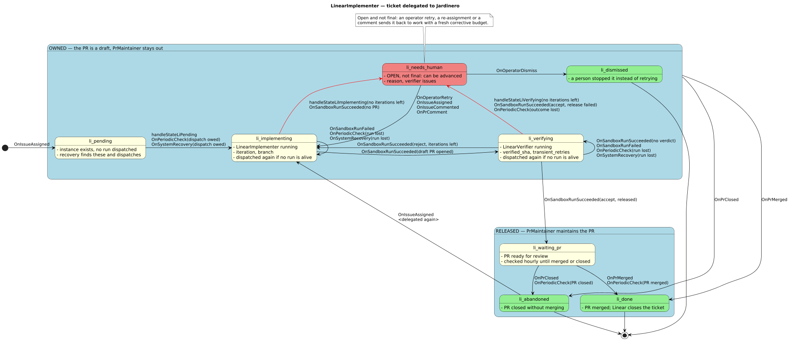

### FixImplementer

Same shape as LinearImplementer, plus the right to refuse: a machine found this work, so "this is not a code bug" is a legitimate ending.

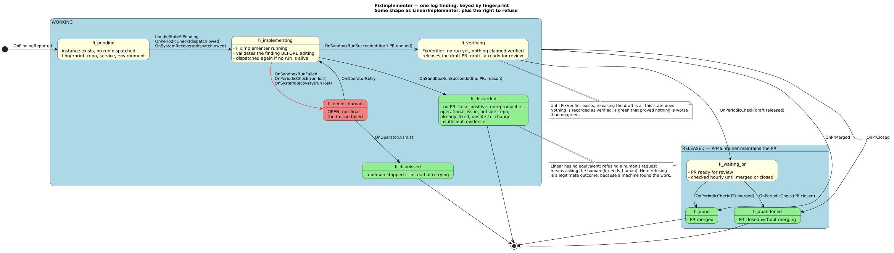

### PrMaintainer

Answers review comments and red CI on one pull request, pass after pass, until it is merged, closed, or the passes run out.

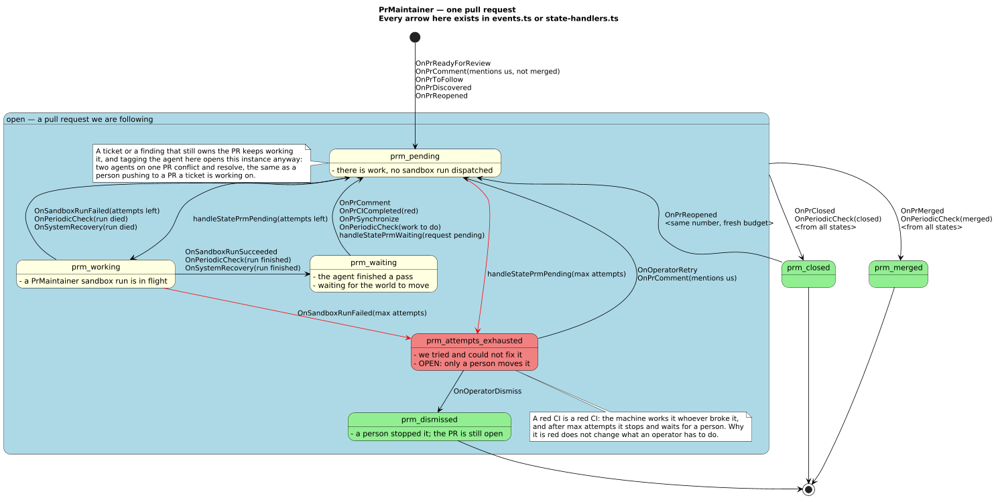

### LogReviewer

Reads a service's logs through Grafana and hands each finding it is confident about to a FixImplementer.

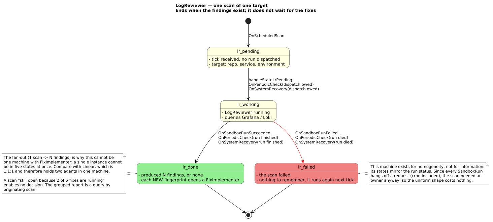

## Flows

One diagram per way work reaches us, end to end across the workflows.

### 2A — GitHub: comment, CI or push on a pull request

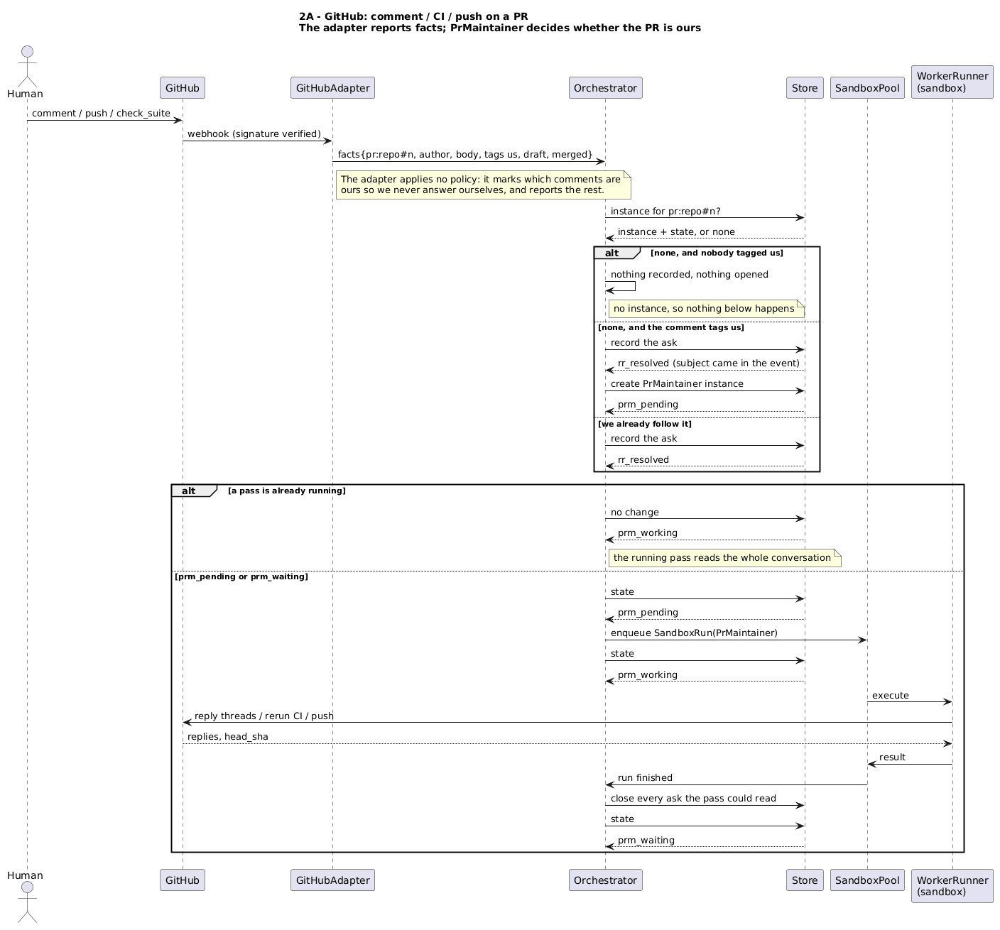

### 2B — GitHub: the agent is tagged on someone else's pull request

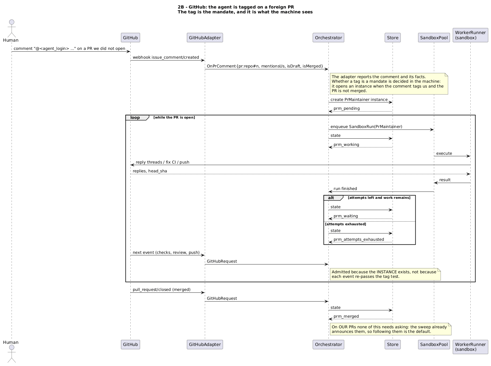

### 3A — Linear: a ticket is delegated to Jardinero

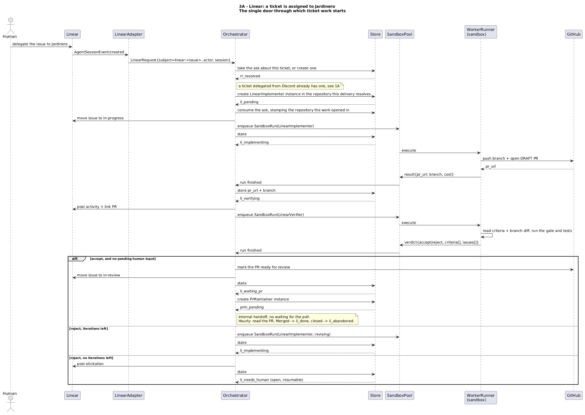

### 4A — A log scan and the fixes it opens

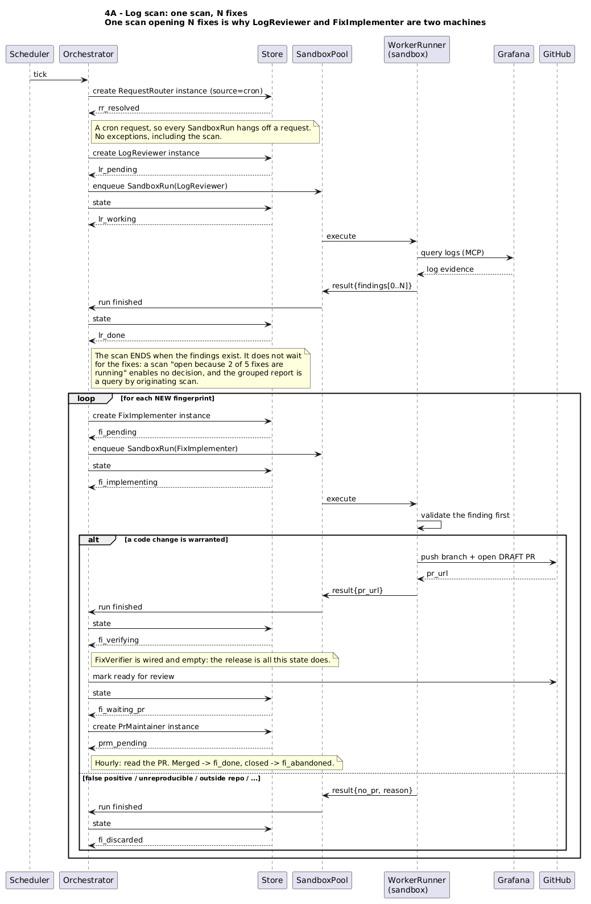

### 4B — The pull request sweep, the safety net for a missed webhook

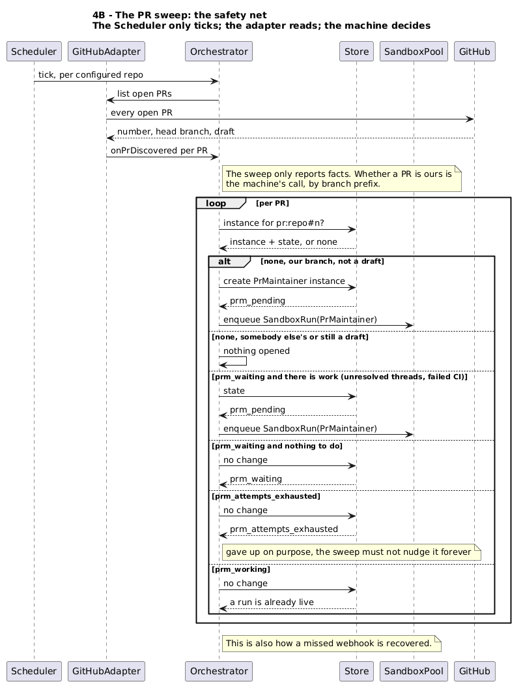

### 1A — Discord `/jardinero-ticket`: a ticket that already exists

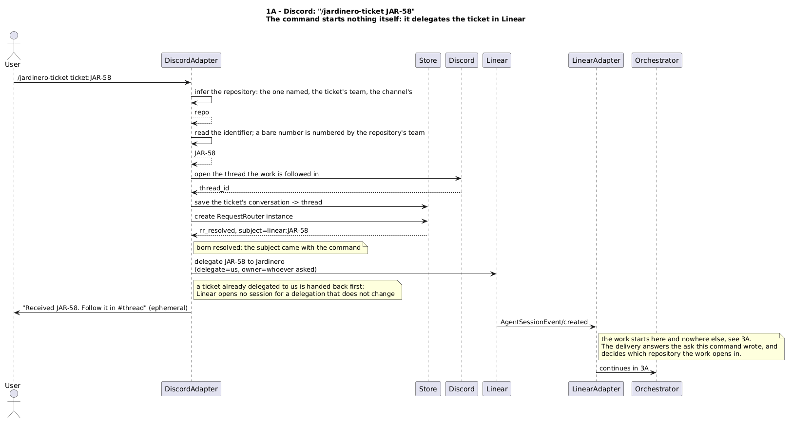

### 1B — Discord `/jardinero-code`: a request in your own words

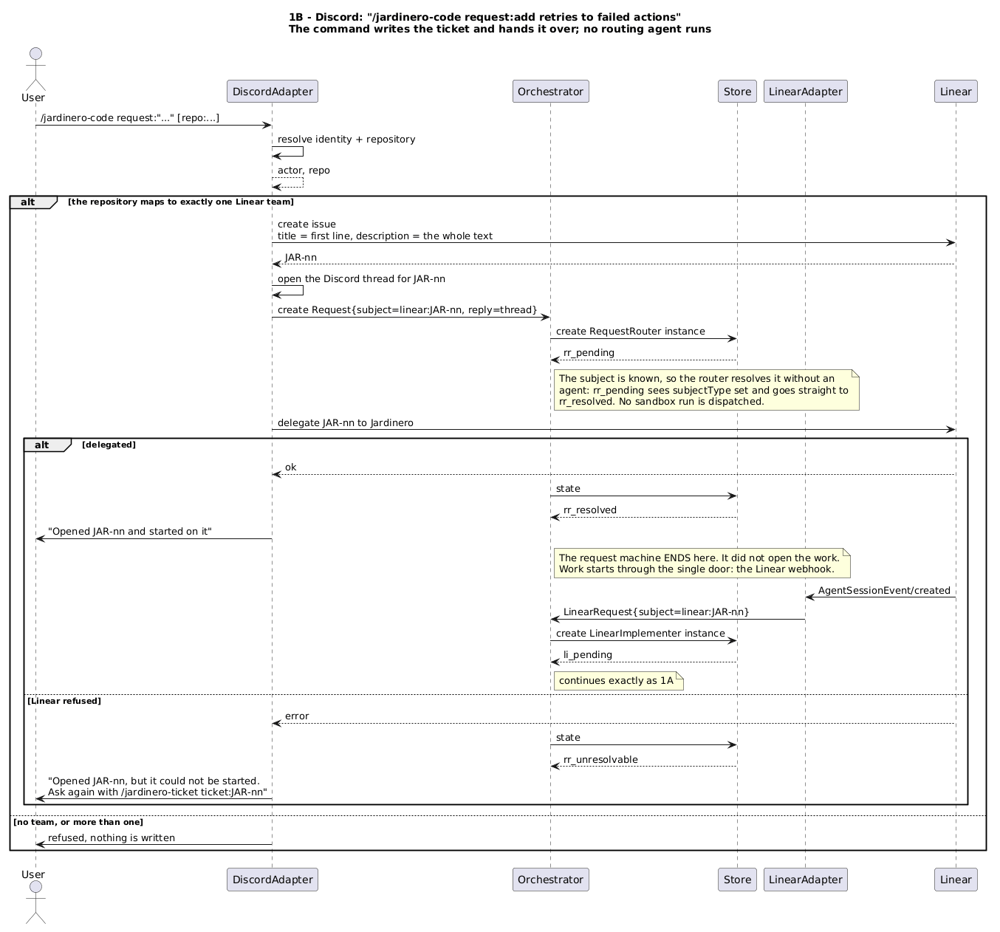

`/jardinero-status` is the third command. It answers from what is already stored, so it opens no workflow and has no diagram.

Not built yet, kept because they are the shape the next pieces take: [1C](sequences/1c-discord-adopt-pr.png) for adopting a pull request from Discord, and [3B](sequences/3b-linear-ticket-commented.png) for a comment on a ticket already being worked on.

## Editing a diagram

Each `.png` is rendered from the `.puml` beside it. Change the source and run `./render-diagrams.sh` (or pass it the files you touched); it renders through the public PlantUML server, so nothing needs installing. Point `PLANTUML_SERVER` at a local one to render offline.
